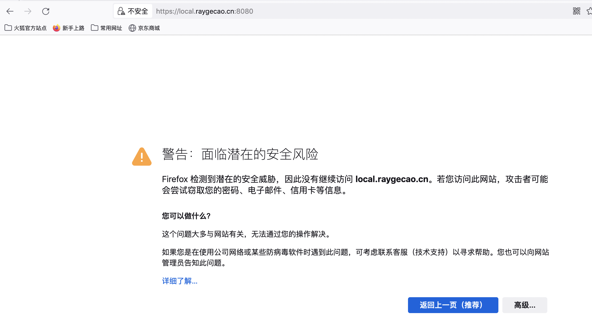
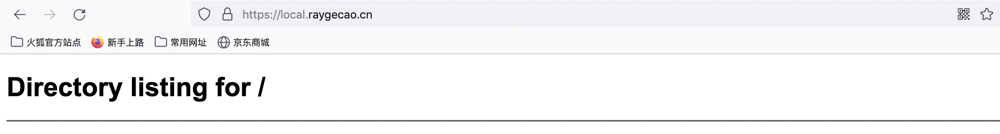

https改造的核心工作是申请证书，本文重点探索内网应用的证书申请。
<!--more-->

## 背景

近期在内网开发了个http协议的web应用，在分配子域名时，由于根域名配置了[HSTS](https://en.wikipedia.org/wiki/HTTP_Strict_Transport_Security)，在浏览器中访问过根域名后无法访问http协议的子域名，因而需要将访问该服务的协议改造成https。

改造成https有两个主流的方案：**应用直接改造**和**使用https代理**。本例以部署在localhost为例，并建立`local.raygecao.cn`指向`127.0.0.1`的A记录。

## 应用直接改造

将应用协议改造成https是最直接的一种方案，改造的核心工作是申请一个SSL证书。

一旦有了证书，应用的改造便极为简单，下面以golang为例展示https应用的改造：

```go
func main() {
	handler := http.HandlerFunc(
		func(writer http.ResponseWriter, request *http.Request) {
			writer.Write([]byte("Hello World"))
		})

	/* http
	log.Panicln(http.ListenAndServe(":8080", handler))
	*/

	// https
	log.Panicln(http.ListenAndServeTLS(":8080", "cert.pem", "key.pem", handler))
}
```

### 内网CA颁发证书

对于内网环境，主流的方案使用内网CA颁发的证书。我们以本地CA模拟内网CA颁发证书的流程：

**创建本地CA**

```shell
$ openssl genrsa -out ca.key 2048   # 创建CA key
$ openssl req -x509 -new -nodes -key ca.key -days 730 -out ca.crt -subj "/CN=test" # 创建自签名证书，有效期为两年
```

**使用本地CA签署证书**

```shell
$ openssl genrsa -out server.key 2048  # 创建服务端key
$ openssl req -new -key server.key -out server.csr -subj "/CN=local.raygecao.cn" # 创建CN为local.raygecao.cn的csr
$ openssl x509 -req -in server.csr -CA ca.crt -CAkey ca.key -CAcreateserial -out server.crt -days 365  # 根据csr创建经本地ca签名过的证书，有效期为一年
```

`server.key`与`server.crt`即为该server的私钥与证书。

**验证**

使用curl验证时，会发现此证书并未被信任：

```shell
$ curl https://local.raygecao.cn:8080
curl: (60) SSL certificate problem: certificate has expired
More details here: https://curl.haxx.se/docs/sslcerts.html

curl performs SSL certificate verification by default, using a "bundle"
 of Certificate Authority (CA) public keys (CA certs). If the default
 bundle file isn't adequate, you can specify an alternate file
 using the --cacert option.
If this HTTPS server uses a certificate signed by a CA represented in
 the bundle, the certificate verification probably failed due to a
 problem with the certificate (it might be expired, or the name might
 not match the domain name in the URL).
If you'd like to turn off curl's verification of the certificate, use
 the -k (or --insecure) option.
HTTPS-proxy has similar options --proxy-cacert and --proxy-insecure.
```

使用浏览器访问会给出风险提示：



因为本地的CA并未被加入信任证书列表，所以浏览器会给出安全风险提示。解决方法是手动将其加入到信任证书列表，或者手动指定证书机构：
```shell
$ curl https://local.raygecao.cn:8080 --cacert ca.crt
Hello World
```

由于证书指定了CN为`local.raygecao.cn`，因如果以其他的域名访问此应用会报错：

```shell
$ curl https://localhost:8080 --cacert ca.crt
curl: (51) SSL: certificate subject name 'local.raygecao.cn' does not match target host name 'localhost'
```

使用内网CA颁发证书可以加强对颁发证书控制的灵活度，比如证书有效期设置，证书的吊销与续约；此外还可以减少向公网CA申请证书的成本。但需要一个完善的同步机制以确保此CA可以被任意内网环境所信任。


### 公网CA颁发证书

如果内网中CA同步机制不完善的话，为了可以正常访问，可以向公网CA去申请证书。目前全球权威证书机构有很多，我们以[Let's Encrypt](https://letsencrypt.org/)这个非盈利性证书机构为例获取证书。

Let's Encrypt使用ACME标准来验证我们对域名的控制权威性，主要手段有二：

- **http验证**：Let’s Encrypt 会向ACME 客户端提供一个令牌，然后ACME 客户端将在web服务器的路径上放置指定文件，如果Let's Encrypt在 web 服务器上找到了放置于正确地点的正确文件，则该验证被视为成功，便可以继续颁发证书。
- **dns验证**： Let’s Encrypt 为 ACME 客户端提供令牌后，客户端将创建从该令牌和您的帐户密钥派生的 **TXT记录**，并将该记录放在 `_acme-challenge.<domain>` 下。 然后 Let’s Encrypt 将向 DNS 系统查询该记录。 如果找到匹配项，便可以继续颁发证书。

**由于Let's Encrypt无法访问内网的web服务器，因此我们只能使用dns验证的方式。**

首先我们需要安装ACME客户端，官方推荐[certbot](https://certbot.eff.org/)，申请流程为：

```shell
$ sudo certbot  -d "local.raygecao.cn" --manual --preferred-challenges dns certonly
# some output...
Please deploy a DNS TXT record under the name:

_acme-challenge.local.raygecao.cn.

with the following value:

jvHmur0iIcTleblY1wrAHMM7TdUOjInFKu6p_Wtlk6o

```

配置完相关的DNS TXT记录后，便可以获得相关的证书及key：

```shell
Successfully received certificate.
Certificate is saved at: /etc/letsencrypt/live/local.raygecao.cn/fullchain.pem
Key is saved at:         /etc/letsencrypt/live/local.raygecao.cn/privkey.pem
This certificate expires on 2023-04-02.
These files will be updated when the certificate renews.
```

由于大多数浏览器都信任了Let's Encrypt，因此整个内网环境都可以顺利访问此https应用。



Let's Encrypt 证书的有效期为90天，并且不可调整，官方推荐每60天自动续期一次。




## 使用https代理

除了原地改造应用的协议之外，一种比较间接的方式使用使用https反向代理。反向代理有多种，如haproxy，nginx，caddy等。其中[caddy](https://caddyserver.com/)主打**automatic HTTPS**特性，因此我们使用caddy作为https反向代理。

caddy的自动化https特性旨在可以自动地将http应用代理成https，核心的原理是caddy会自动向Let's Encrypt申请证书并定期进行续约（caddy实现了ACME客户端）。

但遗憾的是由于这种自动化https使用的是http验证方案，而内网服务又无法使用此验证方案，因此需要使用上述方式手动申请证书，并配置到caddy中。配置文件Caddyfile如下：

```text
local.raygecao.cn: {
        tls /etc/letsencrypt/live/local.raygecao.cn/fullchain.pem /etc/letsencrypt/live/local.raygecao.cn/privkey.pem
        reverse_proxy localhost:8081
}
```

该配置表明`local.raygecao.cn`会被反向代理到`localhost:8081`，并且禁用auto https，而使用外部证书。

开启一个http server监听8081端口，并执行`caddy run --watch`。由于浏览器大多信任了Let's Encrypt，因此使用浏览器可以安全访问。



## 改造应用 vs https代理

| 指标         | 改造应用 | https代理          |
| ------------ | -------- | ------------------ |
| 侵入性       | 有       | 无                 |
| 证书动态更新 | 不支持   | 支持               |
| 性能         | 较高     | 较低（多一层转发） |
| 引入外部依赖 | 否       | 是                 |

