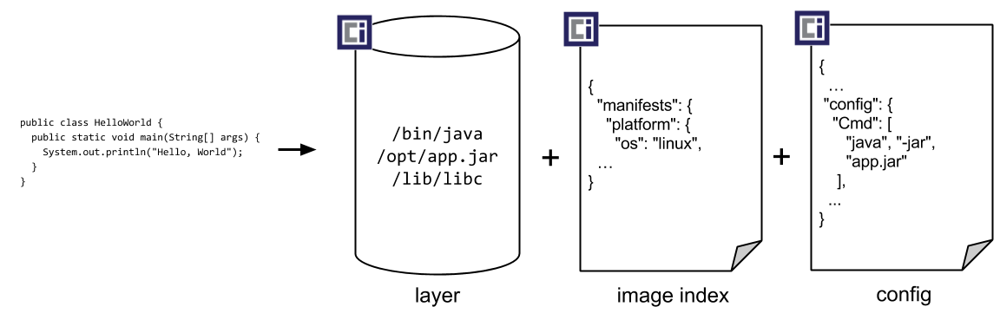

OCI Image Format定义了content addressable与location addressable结合的分层树状结构。
<!--more-->

## 基本组成

- **Image manifest**：用于对镜像的内容寻址。
- **Image index**：指向多个manifest的更高级别manifest，一般用于区分多平台。
- **Filesystem layers**：用于描述容器文件系统内容变化。
- **Configuration**：用于记录镜像配置及运行时信息等元信息。

引用[go-containerregistry](https://github.com/google/go-containerregistry/blob/v2/pkg/v1/remote/README.md)项目中结构图来宏观描述一下上述组成的关系：



[OCI Image Spec](https://github.com/opencontainers/image-spec/blob/main/spec.md)中有更细化的描述：



## Content Descriptor

Content descriptor用于描述对象内容的位置，组件内的descriptor可以描述当前组件对其他组件的引用关系，其应包含如下核心元素：

- 内容的类型
- 内容唯一标识
- 内容的大小

### 属性描述

| 属性          | 类型                | 作用                                     |
| ------------- | ------------------- | ---------------------------------------- |
| `mediaType`   | `string`            | 对象内容的类型                           |
| `digest`      | `string`            | 对象内容的唯一标识，常使用sha256算法加密 |
| `size`        | `int64`             | 对象内容的字节数                         |
| `urls`        | `[]string`          | 对象可以被下载的url列表（optional）      |
| `annotations` | `map[string]string` | 携带额外信息的键值对集合                 |



`mediaType`用于唯一地标识当前blob的类型，通过此类型可以标准化对blob的处理。以containerd的[image.ChildrenHandler](https://github.com/containerd/containerd/blob/main/images/image.go#L329-L369)获取当前descriptor所有直接子引用为例。可以看出对不同blob的处理依据就是`mediaType`。

```go
// Children returns the immediate children of content described by the descriptor.
func Children(ctx context.Context, provider content.Provider, desc ocispec.Descriptor) ([]ocispec.Descriptor, error) {
	var descs []ocispec.Descriptor
	switch desc.MediaType {
	case MediaTypeDockerSchema2Manifest, ocispec.MediaTypeImageManifest:
		p, err := content.ReadBlob(ctx, provider, desc)
		if err != nil {
			return nil, err
		}

		// TODO(stevvooe): We just assume oci manifest, for now. There may be
		// subtle differences from the docker version.
		var manifest ocispec.Manifest
		if err := json.Unmarshal(p, &manifest); err != nil {
			return nil, err
		}

		descs = append(descs, manifest.Config)
		descs = append(descs, manifest.Layers...)
	case MediaTypeDockerSchema2ManifestList, ocispec.MediaTypeImageIndex:
		p, err := content.ReadBlob(ctx, provider, desc)
		if err != nil {
			return nil, err
		}

		var index ocispec.Index
		if err := json.Unmarshal(p, &index); err != nil {
			return nil, err
		}

		descs = append(descs, index.Manifests...)
	default:
		if IsLayerType(desc.MediaType) || IsKnownConfig(desc.MediaType) {
			// childless data types.
			return nil, nil
		}
		log.G(ctx).Debugf("encountered unknown type %v; children may not be fetched", desc.MediaType)
	}

	return descs, nil
}
```



## Image Manifest

Manifest用于定位镜像内容，可以认为是一个镜像的实际入口，包含一个特定platform下image所需的全部信息：

- 若干个layers
- 一个configuration

### MediaType

- `application/vnd.oci.image.manifest.v1+json` OCI Image Format Spec
- `application/vnd.docker.distribution.manifest.v2+json` 兼容Docker Image Format Spec

### 属性描述

| 属性                | 类型                | 作用                                                         |
| ------------------- | ------------------- | ------------------------------------------------------------ |
| **`schemaVersion`** | `int`               | 指定manifest schema，为确保与旧版本docker兼容，此Spec下固定值为2 |
| **`mediaType`**     | `string`            | 内容的类型                                                   |
| **`config`**        | `descriptor`        | 与容器运行时相关的配置信息                                   |
| **`layers`**        | `[]descriptor`      | 用于构建镜像内文件系统布局，其中layers[0]描述base layer      |
| **`annotations`**   | `map[string]string` | 携带额外信息的键值对集合                                     |

### 实践探索

以linux/amd64下的`ubuntu:21.04`为例，我们看一下其manifest:

```json
{
  "schemaVersion": 2,
  "mediaType": "application/vnd.docker.distribution.manifest.v2+json",
  "config": {
    "mediaType": "application/vnd.docker.container.image.v1+json",
    "size": 1462,
    "digest": "sha256:bf70ebd2c444440ae068c5ccea80e2087906a825ff1019a9f6d6cbb229e33481"
  },
  "layers": [
    {
      "mediaType": "application/vnd.docker.image.rootfs.diff.tar.gzip",
      "size": 31837572,
      "digest": "sha256:4451f5c7eb7af74432585f5ebfbeb01bbfc87ec4a74dc93703bdd89330559cd1"
    }
  ]
}
```

可以看到，其mediaType为`application/vnd.docker.distribution.manifest.v2+json`，包含一个config blob与一个layer blob。

## Image Index

Index又被称为fat manifest，manifest可以视为layer的索引，而index是在manifest上又加了一层的索引。有了index，这种两层树状结构变成了多层，提供了多描述符入口点。

> 在docker image中，index的主要作用是区分多平台（OS/ORCH）。

### MediaType

- `application/vnd.oci.image.index.v1+json` OCI Image Format Spec
- `application/vnd.docker.distribution.manifest.list.v2+json` 兼容Docker Image Format Spec

### 属性描述

| 属性                | 类型                | 作用                                                         |
| ------------------- | ------------------- | ------------------------------------------------------------ |
| **`schemaVersion`** | `int`               | 指定manifest schema，为确保与旧版本docker兼容，此spec下固定值为2 |
| **`mediaType`**     | `string`            | 内容的类型                                                   |
| **`manifests`**     | `[]object`          | 描述运行时要求的最小集，主要是**操作系统/架构**等平台相关，列表中有多个manifest，提供平台相关的属性用以进行filter。 |
| **`annotations`**   | `map[string]string` | 携带额外信息的键值对集合                                     |

### 实践探索

我们看一下dockerhub上ubuntu:21.04的index。

```json
{
   "schemaVersion": 2,
   "mediaType": "application/vnd.docker.distribution.manifest.list.v2+json",
   "manifests": [
      {
         "mediaType": "application/vnd.docker.distribution.manifest.v2+json",
         "size": 529,
         "digest": "sha256:ef8ee90cfa9cfc7c218586dea9daa6a8d1d191b3c73be143f4120fe140dae3d0",
         "platform": {
            "architecture": "amd64",
            "os": "linux"
         }
      },
      {
         "mediaType": "application/vnd.docker.distribution.manifest.v2+json",
         "size": 529,
         "digest": "sha256:b7de3b708ddbdb5ca7d0a6a81f6d9df450276fc4794174a7b7a3441b00281a61",
         "platform": {
            "architecture": "arm",
            "os": "linux",
            "variant": "v7"
         }
      },
      {
         "mediaType": "application/vnd.docker.distribution.manifest.v2+json",
         "size": 529,
         "digest": "sha256:ca763e1a382a5b23f91abaf1c36a84be33da2d657f45746112f28ae010571041",
         "platform": {
            "architecture": "arm64",
            "os": "linux",
            "variant": "v8"
         }
      },
      {
         "mediaType": "application/vnd.docker.distribution.manifest.v2+json",
         "size": 529,
         "digest": "sha256:54b3fc49fc1949bcedbafbf1f18393920545ba934331cf72176cb14087962879",
         "platform": {
            "architecture": "ppc64le",
            "os": "linux"
         }
      },
      {
         "mediaType": "application/vnd.docker.distribution.manifest.v2+json",
         "size": 529,
         "digest": "sha256:9c389f10c2b192dd01e87188c7cf1591dc830370046085190dd3ecfdaa1f2cfb",
         "platform": {
            "architecture": "riscv64",
            "os": "linux"
         }
      },
      {
         "mediaType": "application/vnd.docker.distribution.manifest.v2+json",
         "size": 529,
         "digest": "sha256:13532df2f7a272c2c973268db5264059be5ba9882962d30db3d86ca38db3a737",
         "platform": {
            "architecture": "s390x",
            "os": "linux"
         }
      }
   ]
}
```

从中不难看出，该镜像提供了六种CPU架构下编译的ubuntu镜像，当某个client发出`docker pull`命令时，registry会index到对应的架构平台，找到合适的manifest。

## Filesystem layer

Layer是镜像内文件系统的组成成分，每一层都都再描述一系列文件系统变化。

### MediaType

- `application/vnd.oci.image.layer.v1.tar+gzip` OCI Image Format Spec
- `application/vnd.docker.image.rootfs.diff.tar.gzip` 兼容Docker Image Format Spec

###  实践探索

我们copy出ubuntu:21.04的layer并解压，看一下base image的样式，tar内文件太多，仅列出前10行。

```shell
$ cp blobs/sha256/44/4451f5c7eb7af74432585f5ebfbeb01bbfc87ec4a74dc93703bdd89330559cd1/data ~/ubuntu.tar.gz && gzip -d ~/ubuntu.tar.gz -c | tar tv | head -10

# output
lrwxrwxrwx 0/0               0 2021-07-24 01:47 bin -> usr/bin
drwxr-xr-x 0/0               0 2021-04-19 15:26 boot/
drwxr-xr-x 0/0               0 2021-07-24 01:50 dev/
drwxr-xr-x 0/0               0 2021-07-24 01:50 etc/
-rw------- 0/0               0 2021-07-24 01:47 etc/.pwd.lock
-rw-r--r-- 0/0            3028 2021-07-24 01:47 etc/adduser.conf
drwxr-xr-x 0/0               0 2021-07-24 01:50 etc/alternatives/
-rw-r--r-- 0/0             100 2021-04-14 18:32 etc/alternatives/README
lrwxrwxrwx 0/0               0 2021-07-24 01:50 etc/alternatives/awk -> /usr/bin/mawk
lrwxrwxrwx 0/0               0 2021-07-24 01:50 etc/alternatives/nawk -> /usr/bin/mawk
```



可以通过`... | awk '{print $6}' | awk -F/ '{print $1}'| sort | uniq` 对上述输出结果进行聚合获取第一层目录，结果可以看到就是标准的ubuntu文件系统。



再探索一下filesystem changeset的内容，新创建一个镜像，修改镜像内的文件系统

```dockerfile
FROM ubuntu:21.04
RUN echo "hello world" > /tmp/hello.txt
COPY ccc .
```

分别将第二层与第三层的内容拷贝出来并解压

```shell
# 略去拷贝过程

######Layer2######
$ tar zxvf layer2.tar.gz
tmp/
tmp/hello.txt

######Layer3######
$ tar zxvf layer3.tar.gz
ccc
```

上述结果验证了之前踩过的一个坑：写Dockerfile构建镜像时，使用`COPY`将宿主机上的文件复制到镜像里时，如果源文件变化了，docker缓存会失效。之前误以为一个dockerfile中的一条语句对应一个layer，只要语句不变，layer就不变，就可以使用cache。此例清晰地描述出layer会与文件系统的changeset密切相关。

## Configuration

用于描述镜像的一些元信息及容器运行时所需的信息。

### MediaType

- `application/vnd.oci.image.config.v1+json` OCI Image Format Spec
- `application/vnd.docker.container.image.v1+json` 兼容Docker Image Format Spec

### 属性描述

| 属性           | 类型     | 作用                                                         |
| -------------- | -------- | ------------------------------------------------------------ |
| `created`      | `string` | 描述镜像创建日期                                             |
| `author`       | `string` | 描述镜像创建的作者                                           |
| `architecture` | `string` | 描述编译镜像中二进制包的节点CPU架构                          |
| `os`           | `string` | 描述构建镜像的节点的操作系统                                 |
| `config`       | `object` | 容器运行时所需要的执行参数（docker run中所能指定的参数），如Volumes，Env，ExposedPort等 |
| `rootfs`       | `object` | 描述image各层DiffID                                          |
| `history`      | `object` | 描述每一层的历史信息                                         |

上述大部分属性可以通过`docker inspect [IMAGE]`获取到。



`DiffID`是layer未压缩时的tar包hash后的digest，可用于解压后内容验证。

由于`DiffID`仅能描述某个layer的信息，无法描述整个layer布局的信息，因此又引入`ChainID`来校验image的布局，主要思想是引入与之前layer的相关性来生成对应layer的ID。从定义上看，第一层base layer的`DiffID`与`ChainID`一致。



### 实践探索

展示一下ubuntu:21.04的configuration，部分与container相关的字段超出此spec范围。

```json
{
  "architecture": "amd64",
  "config": {
    "Hostname": "",
    "Domainname": "",
    "User": "",
    "AttachStdin": false,
    "AttachStdout": false,
    "AttachStderr": false,
    "Tty": false,
    "OpenStdin": false,
    "StdinOnce": false,
    "Env": [
      "PATH=/usr/local/sbin:/usr/local/bin:/usr/sbin:/usr/bin:/sbin:/bin"
    ],
    "Cmd": [
      "bash"
    ],
    "Image": "sha256:2a1126c0612fcbe61f0acaa6b1f2caf3a156b31684219de8bbb763ee3e99940c",
    "Volumes": null,
    "WorkingDir": "",
    "Entrypoint": null,
    "OnBuild": null,
    "Labels": null
  },
  "container": "acac01451c096428e536623ecd3887aa7c79f8377ac8a94885b6ceae8971dfcf",
  "container_config": {
    "Hostname": "acac01451c09",
    "Domainname": "",
    "User": "",
    "AttachStdin": false,
    "AttachStdout": false,
    "AttachStderr": false,
    "Tty": false,
    "OpenStdin": false,
    "StdinOnce": false,
    "Env": [
      "PATH=/usr/local/sbin:/usr/local/bin:/usr/sbin:/usr/bin:/sbin:/bin"
    ],
    "Cmd": [
      "/bin/sh",
      "-c",
      "#(nop) ",
      "CMD [\"bash\"]"
    ],
    "Image": "sha256:2a1126c0612fcbe61f0acaa6b1f2caf3a156b31684219de8bbb763ee3e99940c",
    "Volumes": null,
    "WorkingDir": "",
    "Entrypoint": null,
    "OnBuild": null,
    "Labels": {}
  },
  "created": "2021-07-26T21:21:54.791192114Z",
  "docker_version": "20.10.7",
  "history": [
    {
      "created": "2021-07-26T21:21:54.424131139Z",
      "created_by": "/bin/sh -c #(nop) ADD file:6ae44786caae9af1c6b70dc9cc244e7d4e06fffc0696f68877527d69aa3fc735 in / "
    },
    {
      "created": "2021-07-26T21:21:54.791192114Z",
      "created_by": "/bin/sh -c #(nop)  CMD [\"bash\"]",
      "empty_layer": true
    }
  ],
  "os": "linux",
  "rootfs": {
    "type": "layers",
    "diff_ids": [
      "sha256:ce91b7d7ac5b2c288515e8eee3a83720d6855e7f1cf8dfa6e9b524453956175f"
    ]
  }
}
```

## Image Layout

用于描述OCI内容寻址（**content-addressable**）blob与位置寻址（**location-addressable**）reference的目录结构。



在**location-addressed**存储中，每个数据元素存储在特定的物理媒介中，并且它的（物理媒介）**location**会被记录下来以供后续访问。当想要访问到对应数据内容时，只需要在request中使用这个**location**即可。位置寻址不关心存储的具体内容是什么，只关心内容存储在什么位置，内容的大小多少（与盘空间占用相关），location所标识的内容可以被灵活地修改/覆盖/删除。

与之相比，**content-addressed**存储通过与内容相关的唯一ID来定位，通过存储系统找到对应的内容。内容一旦发生变化，这个标识ID也会发生变化，即寻址地址也会发生变化。由于这个特点，一般的**content-addressed**系统不允许修改原有的内容，并且删除操作也会通过严格的策略进行控制。

参考[wikipedia: Content-addressed vs. location-addressed](https://en.wikipedia.org/wiki/Content-addressable_storage#Content-addressed_vs._location-addressed)



### 结构组成

- **blobs目录**：包含内容寻址的blob。
  - 子目录是hash算法名称
  - 内容索引形式为`blobs/<alg>/<encoded>`
- **oci-layout 文件**：声明OCI image-layout的版本。
- **Index.json文件**：image-layout中reference的入口点。
  - 一般使用`org.opencontainers.image.ref.name` annotation声明引用。
  - 组织形式与image index形式十分相似。

### 示例

比较完善的示例是[helm对OCI支持](https://helm.sh/docs/topics/registries/)，chart的发布支持OCI规范，实现上依赖于本地的OCI Image Layout与OCI registry做交互完成chart的发布。


graph LR
chart[helm chart]--save-->local[OCI Image Layout]
local --push-->registry[OCI registry]
registry--pull-->local
local --export-->chart


使用`save` cmd保存两个版本的chart。

```shell
$ helm chart save mychart-0.1.0 myregistry:5000/mychart:v0.1.0

ref:     myregistry:5000/mychart:v0.1.0
digest:  dfec110f2b7aecb1d8604d64f7f32026b0af51aa1286627c6520ff2cf1576337
size:    3.7 KiB
name:    mychart
version: 0.1.0
v0.1.0: saved

$ helm chart save mychart-0.2.0 myregistry:5000/mychart:v0.2.0

ref:     myregistry:5000/mychart:v0.2.0
digest:  fe45ba098c1f8bc61e19245c6123f47d7c51f78cec016834e2c0c26c28901e24
size:    3.7 KiB
name:    mychart
version: 0.2.0
v0.2.0: saved
```

local OCI image layout的结构为：

```shell
$ tree ~/.cache/helm/registry/cache

├── blobs
│   └── sha256
│       ├── 573f8b72a735d3f6e5919acb325d365aeddf69edee1e4840c59a5d741179da97
│       ├── 65a07b841ece031e6d0ec5eb948eacb17aa6d7294cdeb01d5348e86242951487
│       ├── 98ddb183b4658761a6e431fbbde4c6c15863b0c3597b74b519c67776830de282
│       ├── dfec110f2b7aecb1d8604d64f7f32026b0af51aa1286627c6520ff2cf1576337
│       ├── e76837ca35eb2e8f22ce8a78f14a1275511eafed58b76955b2ac7ddd0211c965
│       └── fe45ba098c1f8bc61e19245c6123f47d7c51f78cec016834e2c0c26c28901e24
├── index.json
├── ingest
└── oci-layout
```

查看一下index.json中的内容`cat ~/.cache/helm/registry/cache/index.json | jq .`

```json
{
  "schemaVersion": 2,
  "manifests": [
    {
      "mediaType": "application/vnd.oci.image.manifest.v1+json",
      "digest": "sha256:dfec110f2b7aecb1d8604d64f7f32026b0af51aa1286627c6520ff2cf1576337",
      "size": 322,
      "annotations": {
        "org.opencontainers.image.ref.name": "myregistry:5000/mychart:v0.1.0"
      }
    },
    {
      "mediaType": "application/vnd.oci.image.manifest.v1+json",
      "digest": "sha256:fe45ba098c1f8bc61e19245c6123f47d7c51f78cec016834e2c0c26c28901e24",
      "size": 322,
      "annotations": {
        "org.opencontainers.image.ref.name": "myregistry:5000/mychart:v0.2.0"
      }
    }
  ]
}
```

从`index.json`中很容易看出来通过descriptor中的digest与`org.opencontainers.image.ref.name` annotion将location（chart reference）与content（OCI manifest）关联了起来。

## 总结与延伸

本文介绍了OCI Image Format Spec的组成，其对mediaType做了兼容，可以说是Docker Image Format Spec的一个超集。但OCI Image Format Spec要更通用些，体现在layer content可以更加多样，并且index不局限于一层。在此通用规范下可以做一些更cool的事情，比如[OCI Artifacts](https://github.com/opencontainers/artifacts)。

此外，OCI Image Format Spec与[OCI Runtime Spec](https://github.com/opencontainers/runtime-spec)及[OCI Distribution Spec](https://github.com/opencontainers/distribution-spec)密切相关，比如image config如何转换成runtime bundle；image如何存储到registry。可见OCI Image Format Spec是OCI 规范中关键纽带。

后续会写一篇文章来描述一个私有化交付下的应用打包方案，从中可以看到OCI Artifacts，OCI Image Format Spec与OCI Distribution结合起来释放的强大力量。
